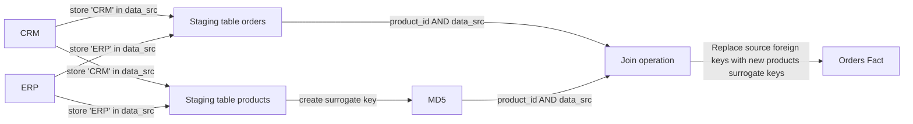

# ELT-Engine


## Table of Contents 
- [Introduction](#introduction)
- [Approach](#approach)
- [Tech Stack & Tools](#tech-stack--tools)
- [Assumptions](#assumptions)
- [Pipeline Architecture](#pipeline-architecture)
- [DBT Directory Structure](#dbt-directory-structure)
- [Airflow DAG Overview](#airflow-dag-overview)
- [Data Warehouse Model](#data-warehouse-model)
- [Data Lineage](#data-lineage)
- [Reporting](#reporting)


## Introduction 
This project designed to ingest and transform data from multiple sources (CRM and ERP systems) into Snowflake. It follows the Medallion Architecture to structure data efficiently for analytics. The pipeline leverages dbt (Data Build Tool) to transform raw data into analytics-ready datasets, ensuring high-quality, governed, and optimized data models for reporting and business intelligence.

## Approach


## Tech Stack & Tools
- **DBT (Data Build Tool)**: For building and transforming data models.
- **Snowflake**: As the data warehouse.
- **Docker**: To containerize and standardize the development environment.
- **Python**: For scripting and automation.
- **Airflow** (optional): For orchestrating ETL workflows.
- **Power BI** (optional): For visualizing the reporting layer.

## Assumptions
Snowflake is the database platform used for data storage and transformations.
Docker is installed and used for containerized environments.
Required datasets are accessible in a suitable format (CSV).

## Pipeline Architecture 


The project follows the Medallion Architecture, which organizes data into three layers:

    Bronze Layer (Raw Data): Stores unprocessed and ingested data from various sources.
    Silver Layer (Cleansed Data): Cleans and pre-processes data for transformation and enrichment.
    Gold Layer (Aggregated Data): Optimized for analytics, reporting, and business intelligence.

## Airflow DAG Overview


If using Airflow for orchestration, the DAG performs the following tasks:

Extract: Reads raw data from source olap database or APIs.
Load: Loads data into the PostgreSQL database.
Transform: Executes DBT models to build staging, dimension, and fact tables.

## Data Warehouse Model 
```mermaid
erDiagram
    customer_dim {
        string customer_sk
        int customer_id
        string customer_unique_key
        string first_name
        string last_name
        string gender
        date birth_date
        string country
    }

    date_dim {
        string date_key
        date date_value
        int year
        int month
        int day
        int quarter
        string day_name
        string month_name
    }

    product_dim {
        string product_sk
        int product_id
        string product_number
        string product_name
        string category
        string sub_category
        string maintenance
        float product_cost
        string product_line
        date start_date
    }

    sales_fact {
        string order_number
        string product_key
        string customer_id
        string order_date_key
        string ship_date_key
        string due_date_key
        float sales
        int quantity
        float price
    }

    -- Relationships
    sales_fact ||--o{ customer_dim : "customer_id"
    sales_fact ||--o{ product_dim : "product_key"
    sales_fact ||--o{ date_dim : "order_date_key"
    sales_fact ||--o{ date_dim : "ship_date_key"
    sales_fact ||--o{ date_dim : "due_date_key"
```

## Data Lineage 


## Reporting
### overview 


### customers


For any queries, feel free to reach out! 
# Contact Information
📧 Email: [mahmoud.mamdoh0812@gmail.com](mailto:mahmoud.mamdoh0812@gmail.com)  
🔗 LinkedIn: [Mahmoud Mamdoh](https://www.linkedin.com/in/mahmoud-mamdoh-47a68a203/)  
🐦 Twitter: [@M7M0UD_D](https://x.com/M7M0UD_D)

For any queries, feel free to reach out!


